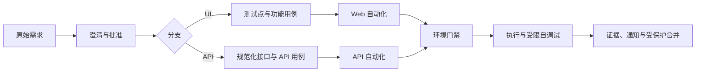

<div align="center">

# 𝓐𝓻𝓰𝓾𝓼

<p align="center">从需求事实到可追溯自动化 · 𝑭𝒓𝒐𝒎 𝑹𝒆𝒒𝒖𝒊𝒓𝒆𝒎𝒆𝒏𝒕𝒔 𝒕𝒐 𝑻𝒓𝒂𝒄𝒆𝒂𝒃𝒍𝒆 𝑨𝒖𝒕𝒐𝒎𝒂𝒕𝒊𝒐𝒏</p>

[](https://www.python.org/)
[](https://docs.docker.com/compose/)
[](https://github.com/koco-co/argus/actions/workflows/ci.yml)
[](https://github.com/koco-co/argus/actions/workflows/regression.yml)

</div>

<a id="overview"></a>

<h2 align="center">𝑶𝒗𝒆𝒓𝒗𝒊𝒆𝒘 · 项目简介</h2>

<p><b>Argus</b> 是面向测试工程团队的规范驱动自动化框架：把原始需求转成可追溯的测试设计，再生成并执行 <b>Web UI</b> 或 <b>API</b> 自动化代码，同时用状态机、不可伪造批准、只读生产门禁和受限自调试保留完整证据链。</p>

- <b>UI</b> 与 <b>API</b> 迭代分支独立路由；第一版机械拒绝混合分支。
- 需求、测试点、功能/<b>API</b> 用例、自动化节点标识与执行记录可双向追溯。
- <b>Playwright</b>、<b>httpx</b>、<b>Pydantic</b>、<b>pytest-xdist</b> 和 <b>Allure</b> 组成生成代码的执行面。
- 锁定的开源 <b>Medusa DTC starter</b> 提供可重建、可重置且有种子金丝雀的真实全栈靶场。
- 自调试只允许修改页对象、组件、<b>API</b> 客户端和模型；断言、测试、需求与种子公式保持冻结。

<a id="workflow"></a>

<h2 align="center">𝑾𝒐𝒓𝒌𝒇𝒍𝒐𝒘 · 工作流</h2>



<p>每个迭代由 `iteration.yaml` 的全局状态机治理。所有 `approvals[]` 只能由 `scripts/record_approval.py` 写入，`state` 与 `events[]` 只能由 `scripts/record_event.py` 写入；`accepted` 工件必须通过 `reopen` 流程修改，不能手工回写。</p>

<a id="capabilities"></a>

<h2 align="center">𝑪𝒂𝒑𝒂𝒃𝒊𝒍𝒊𝒕𝒊𝒆𝒔 · 已实现能力</h2>

| 能力 | 输入 | 输出与门禁 |
| --- | --- | --- |
| 需求与测试设计 | 原始需求或插件信封 | `requirements.yaml`、测试点/豁免、功能或 <b>API</b> 用例、可再生视图 |
| 自动化生成 | 已校验用例与 `seed registry` | <b>POM</b>、类型化客户端/模型、严格 `pytest markers`、追溯节点标识 |
| 环境与安全 | `config/env.<name>.yaml` | `CLI > TEST_ENV > local`；生产环境只收集 `read_only`；数据库语句双层只读防护 |
| 执行与自调试 | 生成测试、真实环境 | `run summary`、`attempt`、`patch-scope`、`trace/log`；三类可验证终态 |
| <b>CI</b> 与交付 | <b>PR</b> 或周计划 | <b>SHA</b> 固定的 `static-checks/e2e`、证据上传、隔离通知、受保护 `release` 收口 |

<a id="quick-start"></a>

<h2 align="center">𝑸𝒖𝒊𝒄𝒌 𝑺𝒕𝒂𝒓𝒕 · 快速开始</h2>

<p>前提：<b>Python 3.12+</b>、<b>uv</b>、<b>Docker</b>、<b>Git</b> 与 `make`。首次安装会下载 <b>Chromium</b>。</p>

```bash
git clone https://github.com/koco-co/argus.git
cd argus
make setup
```

<p>为本地访客流程创建不会提交到 <b>Git</b> 的配置：</p>

```yaml
# config/env.local.yaml
base_url: "http://localhost:8000"
api_base_url: "http://localhost:9000"  # UI/API 组合运行时的后端地址，可省略
cookies: {}
```

<p>启动并验证锁定的 <b>Medusa</b> 靶场：</p>

```bash
make target-app-up
make target-app-healthcheck
```

<p>运行仓库内已生成的 <b>UI/API</b> 全栈样例：</p>

```bash
ARGUS_RUN_ID=readme-smoke TEST_ENV=local \
  uv run pytest -n 2 \
  automation/web/tests/checkout \
  automation/api/tests/checkout
```

<p>预期结果是仓库当前收集的 38 条测试通过（包含正式 Medusa UI/API、既有 fixture 与靶场探针）；其中 UI/API 业务链会对真实 Storefront 和 Store API 执行断言。完成后清理容器、网络与卷：</p>

```bash
make target-app-down
```

<a id="iteration"></a>

<h2 align="center">𝑰𝒕𝒆𝒓𝒂𝒕𝒊𝒐𝒏 · 创建迭代</h2>

```bash
# UI-led
make new-iteration ID=2026-08-checkout BRANCH=ui

# API-led
make new-iteration ID=2026-08-orders BRANCH=api
```

<p>项目级技能位于 `.agents/skills/`，并通过 `.claude/skills/` 的真实符号链接供不同代理入口复用。每个确认点都需要用户针对具体工件明确批准；不得把测试 <b>fixture</b>、聊天中的一般授权或 <b>CI</b> 通过改写成工件批准。</p>

<a id="commands"></a>

<h2 align="center">𝑪𝒐𝒎𝒎𝒂𝒏𝒅𝒔 · 常用命令</h2>

| 目的 | 命令 | 成功条件 |
| --- | --- | --- |
| <b>Lint</b> 与类型 | `make lint` | <b>ruff</b> 与 <b>pyright</b> 零错误 |
| 框架自测 | `uv run pytest scripts/tests` | 所有脚本/<b>Schema</b> 正负 <b>fixture</b> 通过 |
| 迭代校验 | `make validate-iteration ID=<id>` | 目录内所有注册 <b>YAML</b> 合法 |
| 分支覆盖 | `uv run python scripts/check_coverage.py iterations/<id> --tier from-iteration` | 当前状态要求的链路闭合 |
| 导出视图 | `make export ID=<id>` | <b>UI</b> 生成 <b>XMind</b>、<b>API</b> 生成 <b>XLSX</b>，并再生 <b>Markdown</b> |
| <b>UI</b> 回归 | `make web-tests MODULE=<module> ENV=<env>` | 真实浏览器断言通过 |
| <b>API</b> 回归 | `make api-tests MODULE=<module> ENV=<env>` | 类型化请求/响应断言通过 |
| 全量本地钩子 | `uv run pre-commit run --all-files` | 格式、<b>Schema</b>、状态、只读与秘密扫描全部通过 |

<a id="configuration"></a>

<h2 align="center">𝑪𝒐𝒏𝒇𝒊𝒈𝒖𝒓𝒂𝒕𝒊𝒐𝒏 · 配置与安全</h2>

- `config/env.example.yaml` 是环境形状的唯一已提交示例；真实 `env.local/test/prod/ci.yaml` 均被忽略。
- `base_url` 指向浏览器访问的站点；<b>UI/API</b> 组合运行可用可选的 `api_base_url` 指向后端，<b>CI</b> 可通过 `ARGUS_API_BASE_URL` 覆盖，测试代码不得硬编码环境地址。
- 访客流程可省略 `auth` 与 `db`。<b>API-led</b> 正式迭代的 <b>M8</b> 检查要求完整凭据和只读数据库 <b>DSN</b>。
- 代码层 <b>SQL</b> 扫描与 `ReadonlyDBClient` 只是纵深防御；真正的生产边界必须是仅授予 <b>SELECT</b> 的数据库角色和主机侧控制。
- `TEST_ENV=prod` 时，`pytest collection` 只保留显式 `@pytest.mark.read_only` 的用例。
- 通知配置位于被忽略的 `config/notify.yaml`；支持钉钉、飞书、企业微信和邮件，单个频道失败不会阻塞其他频道或主测试任务。

<a id="evidence"></a>

<h2 align="center">𝑬𝒗𝒊𝒅𝒆𝒏𝒄𝒆 · 验证证据</h2>

<p>2026-08-29 的当前检出已实际完成 430 项框架测试、fresh reset 后正式 <b>Medusa</b> UI 10/10 与 API 22/22、靶场/<b>CI</b> 基础设施探针、真实 <b>PostgreSQL</b> 只读角色的读权限与写拒绝验证、`1440×900` 与 `390×844` 视觉检查；main 手工 Compose-only e2e 在 POM 时序修复前首轮有 1 条 C0005 失败并按规则标记 <code>flaky-suspect</code>，修复合并后 PR e2e 与 main 手工复核均为 38/38、<code>normal</code>。PR #1 与 PR #9 已真实合并到 <code>main</code>，当前 merge SHA 为 <code>88f2b6a</code>。受保护 <code>release</code> 的独立门禁状态仍见验收矩阵。详细命令、运行、哈希和仍需外部事实的门禁见：</p>

- [验收证据矩阵](docs/spec/status/ACCEPTANCE_2026-08-28.md)
- [Medusa 真实路由与种子事实](knowledge/target-app-notes/medusa.md)
- [分支保护验收](docs/spec/status/BRANCH_PROTECTION_2026-08-28.md)
- [环境与命令状态](docs/spec/engineering/ENVIRONMENT_SETUP.md)
- [产品路线图](docs/spec/product/ROADMAP.md)

<a id="boundaries"></a>

<h2 align="center">𝑩𝒐𝒖𝒏𝒅𝒂𝒓𝒊𝒆𝒔 · 边界与许可证</h2>

- 第一版不实现移动端、小程序、性能生成、真实需求/<b>API</b> 来源连接器、混合 <b>UI+API</b> 迭代或 <b>Jenkins</b> 验收入口。
- 测试 <b>fixture</b> 的通过不等同于正式迭代的用户批准、真实外部通知或受保护分支合并。
- 自动防伪是结构冻结、分类器、种子金丝雀、`patch-scope` 与 `trace` 的组合，不能替代最终人工 `diff` 评审。
- 本仓库当前尚未声明开源许可证；在复制、修改或分发前，请由仓库所有者补充并确认授权条款。

<p>权威操作规则见 `AGENTS.md`；需求、数据模型与架构契约位于 `docs/spec/`。</p>
